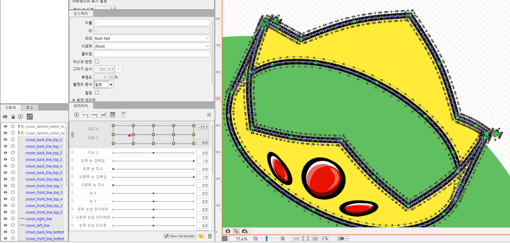

Practice of making production of floating object made in Live2D project.   
   

   
Crown model's making process explained in crown.pdf and their LaTeX project is crown.zip   
   
Basic drawn picture project is crown.clip file and convert to crown.psd file to import in Live2D project.   
cylinder_rotation.blend is reference 3D object project file for making natural movement.   
   
now then making...   